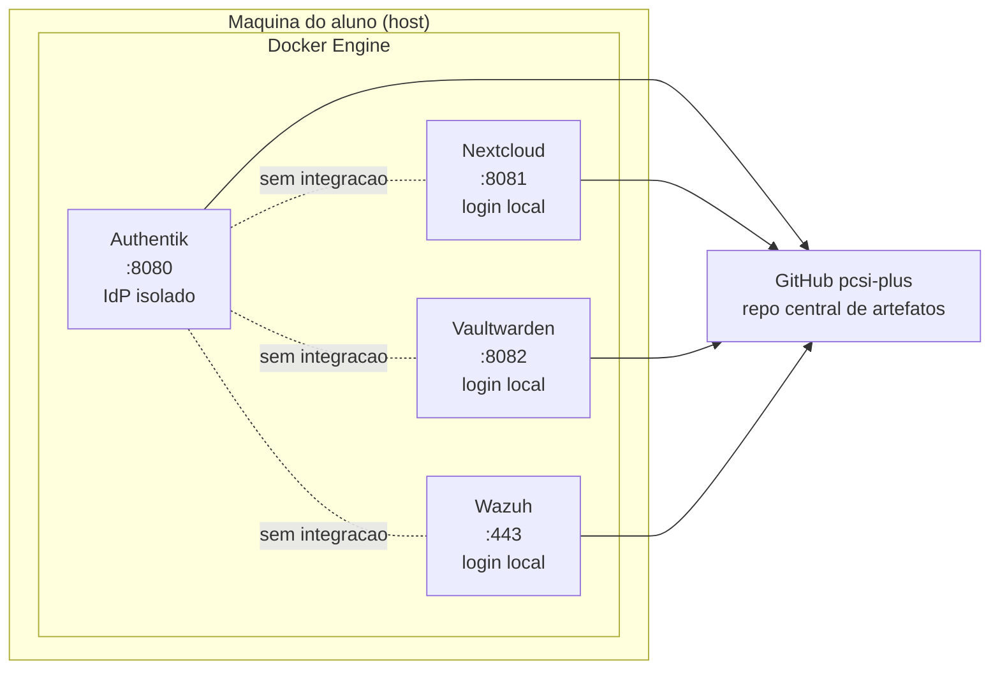
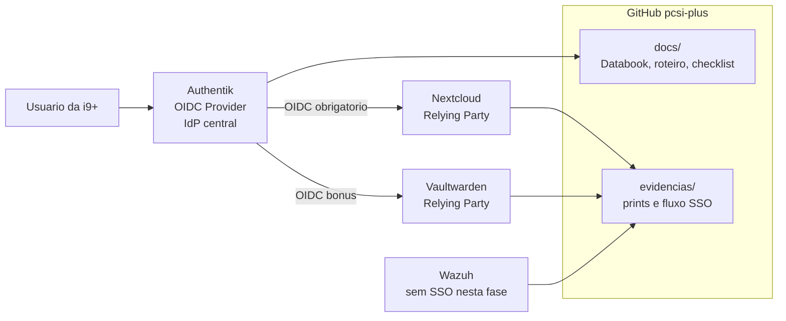
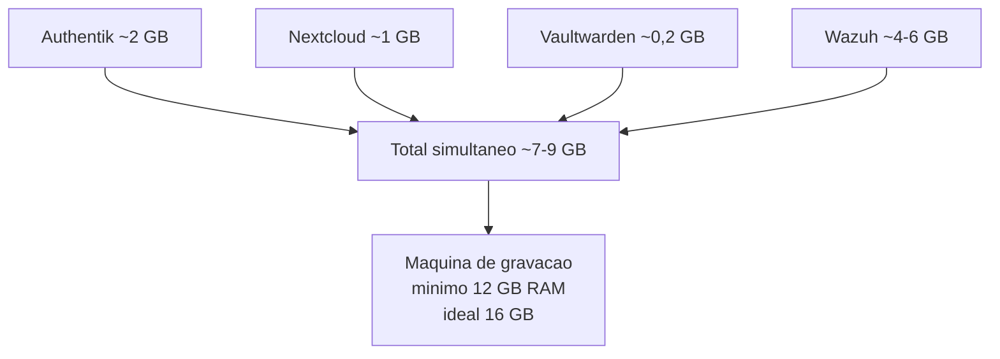

# Reanalise da Arquitetura do PCSI+

## Objetivo desta reanalise

Esta reanalise ajusta a narrativa tecnica da POC do PCSI+ para que a demonstracao final fique mais coerente com o problema descrito no PRD. O foco nao e transformar a POC em ambiente de producao, mas sim melhorar a demonstracao de valor com a menor mudanca possivel no escopo.

## Diagnostico

O backlog atual trata Authentik, Nextcloud, Vaultwarden e Wazuh como ilhas isoladas. Cada ferramenta sobe corretamente, mas cada uma permanece com autenticacao propria e sem dependencia real das demais. Nesse formato, o Authentik aparece apenas como mais uma ferramenta instalada, e nao como o componente que resolve o problema de controle centralizado de identidades e acessos.

Esse ponto enfraquece a apresentacao para a banca porque gera uma pergunta natural: se cada sistema continua com login separado, qual e o ganho concreto de ter um provedor de identidade?

Hoje, a resposta ficaria fraca porque a POC demonstra instalacao, mas nao demonstra centralizacao.

## Problema central

O problema principal nao e tecnico, e arquitetural e narrativo. O PRD afirma que a i9+ sofre com falta de padronizacao, controle e rastreabilidade de acessos. O Authentik so prova valor quando outros servicos passam a depender dele para autenticacao.

Sem isso, a historia mostrada no video vira:

- instalamos quatro ferramentas open source
- cada uma continua com seu proprio login
- o GitHub continua sendo o unico ponto central do projeto

Com integracao minima de identidade, a historia muda para:

- criamos um pequeno ecossistema de seguranca
- o acesso passa a ser centralizado em um IdP
- a demonstracao deixa de ser apenas infraestrutura e passa a ser arquitetura

## Recomendacao objetiva

A menor mudanca com maior ganho e integrar:

- Authentik -> Nextcloud via OIDC como item recomendado e prioritario
- Authentik -> Vaultwarden via OIDC como bonus, se houver tempo

Essa decisao preserva o caracter academico da POC, nao exige ambiente produtivo e melhora fortemente a defesa tecnica do projeto.

## Justificativa da recomendacao

Integrar o Nextcloud ao Authentik e suficiente para responder a pergunta de valor da banca. O fluxo passa a demonstrar:

- um usuario acessa o Nextcloud
- o Nextcloud redireciona para o Authentik
- o login acontece no provedor central
- o usuario retorna autenticado ao servico de arquivos

Isso cria um exemplo claro de SSO, mesmo que o restante do ecossistema ainda esteja parcial ou isolado.

O Vaultwarden pode entrar como extensao natural dessa mesma narrativa, mas nao precisa ser obrigatorio para o sucesso da entrega.

O Wazuh pode continuar fora da integracao nesta fase. Ele resolve outro problema do PRD, ligado a visibilidade e monitoramento, e seu peso operacional ja e alto o bastante para nao virar dependencia adicional do fluxo de identidade.

## Risco operacional para a gravacao final

Existe um risco concreto de infraestrutura para a semana do video. Se a demonstracao final for gravada em uma unica maquina rodando todas as ferramentas ao mesmo tempo, o consumo estimado de memoria RAM fica aproximadamente assim:

- Authentik: ~2 GB
- Nextcloud: ~1 GB
- Vaultwarden: ~0,2 GB
- Wazuh: ~4 a 6 GB

Total estimado simultaneo:

- entre 7 e 9 GB apenas para os servicos

Na pratica, a maquina de gravacao precisa de pelo menos 12 GB de RAM para nao operar no limite. O ideal e usar uma maquina com 16 GB para garantir margem durante navegador, gravacao de tela, edicao leve e processos do sistema operacional.

## Impacto no backlog

Essa melhoria pode ser incorporada como mudanca controlada sem reabrir todo o projeto.

### Ajustes sugeridos no Jira

**US-02 | Authentik**

- adicionar subtarefa para criar Provider OIDC
- adicionar subtarefa para criar Application do Nextcloud
- gerar evidencia do painel do provider e da aplicacao

**US-03 | Nextcloud**

- adicionar subtarefa para configurar login via OIDC com Authentik
- validar login com usuario nao administrador
- gerar evidencia do redirecionamento e do acesso autenticado

**US-06 | QA e Evidencias**

- incluir verificacao do fluxo SSO
- validar se o nome dos arquivos de evidencia do fluxo esta correto
- confirmar se as capturas estao legiveis

**US-08 | Producao do Video**

- incluir uma cena curta de logout e novo login no Nextcloud via Authentik
- usar esse momento como prova de controle centralizado de acesso

**US-09 | Entrega Final**

- incluir no material final uma comparacao entre estado atual e estado recomendado
- registrar que a integracao foi feita como demonstracao de valor da arquitetura

## Decisao recomendada

Se a equipe precisar escolher apenas uma melhoria estrutural para fortalecer a banca, a prioridade deve ser:

1. integrar Authentik com Nextcloud via OIDC
2. reservar uma maquina com 12 GB ou mais para a gravacao
3. tratar Vaultwarden com OIDC como bonus, nao como dependencia critica

## Diagramas

### Diagrama 1 - Estado atual

### Diagrama 2 - Estado recomendado para a demo

### Diagrama 3 - Capacidade minima para a gravacao

## Conclusao

O projeto ja tem boa base tecnica, mas a demonstracao fica muito mais forte se o Authentik deixar de ser apenas uma instalacao e passar a ser um componente funcional da arquitetura. A integracao com Nextcloud via OIDC e a melhor relacao entre esforco, risco e ganho de valor para a banca.
